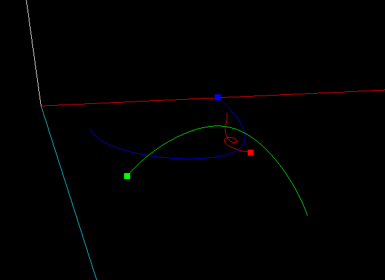
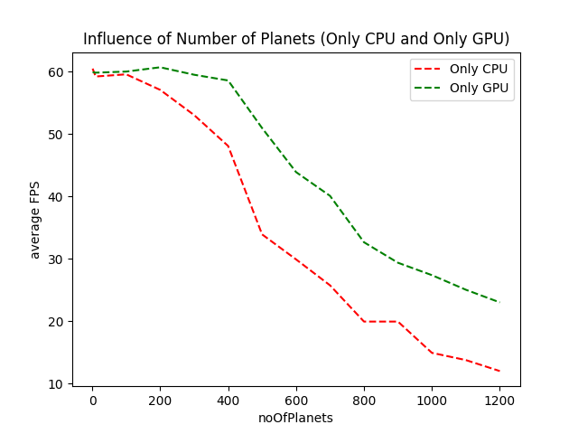
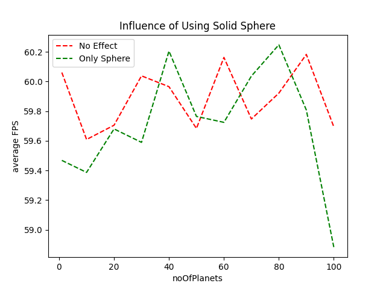
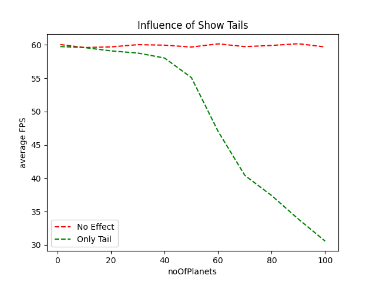

# COMP37111

In my Particle System, I did the N Body simulation. 

## How To Run

To run my code, please first install all dependencies:

```shell
pip3 install numpy
pip3 install PyOpenGL
pip3 install PyQt5
```

**NB: Windows installation of PyOpenGL has a bug, it won't install GLUT correctly. All calls to GLUT function will cause `OpenGL.error.NullFunctionError`.**

There are 2 python files, `n_body.py` and `planetsGenerator.py`. The later merely generates some data (for us to play with) and writes the result to the file, `planets.pkl`. It's example usage is:

```shell
python3 planetsGenerator.py 100
```

The argument indicates how many planets should be generated.

To see the actual project, do:

```shell
python3 n_body.py
```

Then a window will show up. In its menu, you will find a "Help" option, which will guide you how to use all implemented keyboard functions. All GUI components work in an intuitive way.

## Initial Configuration

On start up, my program:

1. Sets initial eye position at `(0, 0, 50)`, looking at origin. 
2. Shows all 3 axes by default. Users can press `a` to toggle off axes.
3. Loads only 3 hard coded planets. Users can add more planets (with random mass, random initial position, random initial velocity, random colour) by clicking `Add` button, or can load some pre-generated planets from `planets.pkl` from menu `File -> Load`. 
4. Renders planets as `GL_POINTS`. Users can toggle on better rendering (as a solid sphere and with global light) by pressing `p`.
5. Toggles off shading test. Press `s` to see it. The shading test contains a green sphere rotating around a red cube at the origin. The purpose is to test if I have correct hidden surface removal and lighting settings. These two things don't count as particles and have no effect on other planets. 
6. Sets Death Star as inactive. Users can toggle it on/off by pressing `k`. The working Death Star generates a green light and kills all planets that touch it (i.e. planet distance to Death Star line is less than planet radius). This function can be better understood if user render planets as solid sphere rather than `GL_POINTS`.
7. Sets planet trails as off. Users can toggle it on/off by pressing `t`. 

## Report

Video can be found [here](https://www.youtube.com/watch?v=IoD4L6Pi8Ik&list=PLDZICvVace4gYyGTo2Gae0cXaG3fRwxXT&index=1). There are three videos altogether, one lasts 11 minutes and the other two is 1 minute each, please watch all of them. 

### 1. Multiple particles appearing on-screen, moving in three dimensions [2 marks]. **RUBRIC: 1 mark for multiple particles appearing; 1 mark for multiple particles moving.**

Done in video.

### 2. Some form of rendering beyond point  [2 marks]. **RUBRIC: 2 marks for any kind of rendering which is not a point. So, either 0 marks or 2 marks [note: if you've just joined up random points with lines or quads etc to make a big fizzing scribbly mess, this doesn't count].**

My program can render particles as solid sphere, shown in video.

### 3. Ability to interactively control the system to change properties of your world and see appropriate effects of the changes. **RUBRIC: 2 marks for being able to interactively change at least 2 different particle properties such as time- to-live or velocity; 2 marks for being able to change any world property such as gravity or wind.**

Changed mass and velocity of the blue planet, changed global gravity constant. In my universe, I assumed all planets have a similar density so you can see blue planet's radius increased when I changed its mass to 100.

### 4. Analysis of the fidelity of your chosen laws of motion – how well do they simulate the behaviour you have chosen to model? Fidelity of chosen laws [3 marks]. **RUBRIC: 1 mark for basic description, i.e. can describe what the laws of motion are intended to be, and demonstrate that the particles roughly follow those; 1 mark for ability to describe informally (eg without captured data) how accurately the laws of motion are simulated; 1 mark for ability to describe with specific data/examples how accurately the laws of motion are simulated.**

N body problem is the problem of predicting the individual motions of a group of planets interacting with each other gravitationally. From the point of physics, gravity is the only force that can change each planets' movement, so my chosen laws of motion is Newton's law of Gravity. Based on the tail of each planets (see pic.1), I'd say my particles are following this law. 



<center>Fig 1. Planets Tail</center>

However, the n body problem is not completely solved yet, so there is no way for us to calculate an accurate, precise location for a specific planet after a specific time period. The only thing we can do is split that time period into many small time intervals and assume planet do linear motion during that internal, the same idea as Calculus. The smaller each time intervals be, the more accurate the simulation will be. 

As stated above, length of time interval is the key to keep an acceptable accuracy. So when I was implementing the speed slider to control simulation speed, a naïve way would do:

```python
def simulate(adjustment):
    acceleration = getAcceleration()
    velocity += adjustment * TIME * acceleration
    position += adjustment * TIME * velocity
    updateFrame()
```

But this will definitely cause loss of accuracy when we want a very fast simulation (thus a huge adjustment). Instead, I did simulation with the same time interval for many iterations, like this:

```python
def simulate(iteration):
    for _ in range(iteration):
        acceleration = getAcceleration()
        velocity += TIME * acceleration
        position += TIME * acceleration
    updateFrame()
```

By this way, we can keep simulation to an acceptable level. The actual code for above example can be found in `PlanetsTable.simulate()` in `n_body.py`.

### 5. Efficiency of your approach to implementing your laws of motion – how efficient is your computation of particle position between frames? **RUBRIC: 1 mark for any evidence that efficiency has been thought of; 1 mark if there is evidence of thinking about efficiency and what measures could be taken to improve it, or a solid argument as to why there is no possible way of improving it; 1 mark for demonstrating that specific measures to improve or maximise efficiency have been implemented.**

Acceleration for particles is hard to calculate as every particle/planet should be consider, a naïve $O(n^2)$ approach would do:

```python
for planet in planets:
    for anotherPlanet in planets:
        if planet is not anotherPlanet:
            planet.acc += calculateAcc(planet, anotherPlanet)
```

Obviously, this is too slow. A bit research leads me to the Barnes-Hut algorithm, which runs in $O(nlogn)$, but implementing this algorithm requires a lot of time and effort. I didn't choose BH way as this is a graphics project, not an algorithm one.

However, optimisation is still possible. All particles/planets are just some array data, thus we can use matrix to speed up our calculation and, a good news is, `numpy` is pretty fast at calculating matrix. So, here is the code I used to calculate acceleration:

```python
x = pos[:, 0: 1]  # To preserve matrix shape, i.e. we want a column vector.
y = pos[:, 1: 2]
z = pos[:, 2: 3]

dx = x.T - x
dy = y.T - y
dz = z.T - z

# 1e-10 to prevent ZeroDivisionError, as distance between a planet and itself is always zero.
inv_r3 = (dx ** 2 + dy ** 2 + dz ** 2 + 1e-10) ** (-1.5)

ax = adjustment * GRAVITY * (dx * inv_r3) @ mass
ay = adjustment * GRAVITY * (dy * inv_r3) @ mass
az = adjustment * GRAVITY * (dz * inv_r3) @ mass

acc = np.hstack((ax, ay, az))

# Calculate velocity.
vel += acc * TIME

# Calculate position.
pos += vel * TIME
```

By this way, my FPS can maintain at around 60 even I have 100 planets. Although it do decrease as I increased to 1000 planets. I'd say this performance is far more better than what I expect for an $O(n^2)$ algorithm.

### 6. Analysis of overall performance / rendering speed, and discussion of efficiencies implemented. Here we’ll be expecting you to be able to comment on the performance of your system; is the performance limited by the CPU? the GPU? How do you know that? Are there any particular bottlenecks in your design, and if so, how could you (hypothetically) improve the performance? This is as much about understanding as it is about implementation so if your system is performing poorly compared to your peers’, but you know why that’s the case and what could be done about it, then you will be able to get some of the marks for this task. For full marks we would expect evidence of experimentation such as graphs of particle numbers versus framerates [4 marks]. **RUBRIC: 1 mark for sensible discussion of how performance is bound by the limitations of data structures/CPU/use of GPU/transfer of data between CPU-GPU; 1 mark for evidence of exploring performance/rendering bounds by performing experiments; 1 mark for analysis/discussion supported by some data; 1 mark for a rigorous performance analysis supported by graphs or other data visualisations.**

Intuitively, I'd say performance is bounded by CPU, actually, by my $O(n^2)$ algorithm. This is true as my frame rate drops to about 10 when I have 1,000 planets while my friend's program only decreases to 10 FPS when they have 10,000+ particles. But, I want to have a clearer understanding about the influence of CPU and GPU, so I designed this experiment. 

In test 1, I deleted all code related to simulation, thus there is no heavy work for CPU, and I draw each planets as `GL_POINTS` without tail, so any decrease in FPS is solely caused by GPU if I increase number of planets. This is shown as green line in Fig 2.

In test 2, I deleted all code related to drawing OpenGL things, so there is nothing to draw for each frame, thus any decrease in FPS is solely caused by CPU if I increase number of planets. This is shown as red line in Fig 2. 



<center>Fig2. Influence of CPU and GPU</center>

It's clear from the above graph that CPU is the biggest limitation for performance, this result is as expected. 

You may notice that even we do not do any CPU calculation, GPU performance is still not ideal, FPS drops to 25 when we have only 1,200 planets. **I've carefully checked my implementation and I can say with 100% confidence that this is caused by PyQt framework (which I used to create an interactive GUI) and the slow python language. This problem is discussed [here](https://stackoverflow.com/questions/9290113/pyopengl-and-pyqt-performance).** I wrote another C program to further prove this. In this C program, I randomly generated 1,000,000 particles and draw them without any movement. Here is the code:

```c
# include <GL/glut.h>
# include <time.h>
# include <stdbool.h>
# include <stdlib.h>
# include <stdio.h>

time_t start;
time_t end;
double frameCount;

void init(void) {
    glClearColor(0.0, 0.0, 0.0, 0.0);
    time(&start);
    frameCount = 0;
}

void idle(void) {
    glutPostRedisplay();
}

void display(void) {
    glClear(GL_COLOR_BUFFER_BIT);
    int i = 0;
    static bool positionGenerated = false;
    static GLfloat positions[3000000];

    // We only generate these value once.
    if (!positionGenerated) {
        positionGenerated = true;
        for (; i < 3000000; i++) {
            positions[i] = (GLfloat) ((float) rand() / RAND_MAX - 0.5) * 2 * 300000000;
        }
    }

    i = 0;
    for (; i < 1000000; i++) {
        glBegin(GL_POINTS);
        glColor3f(1.0, 1.0, 1.0);
        glVertex3f(positions[3 * i], positions[3 * i + 1], positions[3 * i + 2]);
        glEnd();
    }
    frameCount++;
    glutSwapBuffers();
}

void reshape(int w, int h) {
    glViewport(0, 0, (GLsizei) w, (GLsizei) h);
    glMatrixMode(GL_PROJECTION);
    glLoadIdentity();
    gluPerspective (48.0, (GLfloat)w/(GLfloat)h,  10000.0, 800000000.0);
}
void keyboard(unsigned char key, int x, int y) {
    if (key == 27) {
        time(&end);
        // difference is in seconds.
        time_t difference = end - start;
        printf("%lf frames, %ld seconds, FPS: %lf", frameCount, difference, frameCount / difference);
        exit(0);
    }
}

int main(int argc, char* argv[]) {
    glutInit(&argc, argv);
    glutInitDisplayMode(GLUT_DOUBLE | GLUT_RGB);
    glutCreateWindow("Program to prove GPU limitation is caused by PyQt framework and python language");
    glutFullScreen();
    init();
    glutDisplayFunc(display);
    glutReshapeFunc(reshape);
    glutKeyboardFunc(keyboard);
    glutIdleFunc(idle);
    glutMainLoop();
    return 0;
}
```

It's execution result is: `122.000000 frames, 32 seconds, FPS: 3.812500`. **And this program runs in a Virtual Machine which of course is a bit slower than a normal machine.**  

As for possible improvements, firstly, we can accelerate GPU performance by using a technique called VBO, Vertex Buffer Object. VBOs offer substantial performance gains over immediate mode rendering primarily because the data resides in the video device memory rather than the system memory and so it can be rendered directly by the video device. Secondly, we can accelerate CPU performance by using multi-thread as calculation for n body is embarrassingly parallel. Thirdly, choose the $O(nlogn)$ Barnes-Hut algorithm. 

Furthermore, as I can render planets either as `GL_POINTS` or solid sphere, and I can choose weather to draw planet trail or not, so I want to exam the influence of these two visual effects. 

Here, I set "No Effect" as render by `GL_POINTS` and do not show tail.



<center>Fig 3. Influence of Using Solid Sphere</center>

As we can see, although changing from `GL_POINTS` to solid sphere reduces FPS by a little (with some small outliers), but it does not have a huge impact on the overall FPS.



<center>Fig 4. Influence of Show Tails</center>

Surprisingly, showing planets tail has a huge impact on average FPS, perhaps more GPU resources are needed to render `GL_LINES_STRIP` correctly. 

As a conclusion, CPU only becomes the biggest limitation when we have a lot of particles, however, GPU bound should not be much perceivable if we write code in C. But in this very case, with PyQt framework and slow python language, it is noticeable even there are only a litter planets, especially when we toggle on rendering planets tails by `GL_LINES_STRIP`. 

P.S. How FPS data is collected? FPS data is stored in a list, users can manually request average FPS during a time period, which is defined as the time interval between two requests. The resulting AVE_FPS will be written to a file and I wrote another program, `drawStatistics.py`, to draw them. 

### 7. Sophistication and flair. Here were looking for any features or effects beyond a basic particle system, as described in Task 6 above [2 marks]. **RUBRIC: 2 marks for demonstration of 2 different things (which could be taken from the list in Task 7  or could be other things); or 2 marks for one super- thing that is impressive and required significant design/ implementation.**

Demonstrated Death Star destroying planets, planets tail, and flying around in video. And, n body simulation is about interaction between particles in nature.

Knowledge for how to calculate distance between a point and a line in 3D space were leant at [here](https://wenku.baidu.com/view/ed88f4bcfab069dc51220129.html#). For simplicity, I assumed the space line is (in parametric equation form): 
$$
\begin{cases}
x=t\\
y=t\\
z=t
\end{cases}
$$

## Known Bugs

1. In Windows OS, GLUT functions doesn't work and will cause `OpenGL.error.NullFunctionError`. Program will halt if user toggle on rendering by pressing `p` on Windows computers. 

## Bug-Like Behaviour But Actually Is Not And Can Be Solved By Users

1. Program complains `glutSolidSphere()` cannot be called without `glutInit()` and halts. GLUT functions are system dependent in PyQt5 framework. Sadly I didn't realise this until I've finished this project. In Linux, `glutInit()` should be called manually where as we don't need to, and shouldn't do so in MacOS. The interesting bit is: ***ALL GLUT functions will cause `OpenGL.error.NullFunctionError` in Windows system***. I've done all I'm capable of to ensure my code runs smoothly in school Linux VM.
2. Program writes PyQt related information to `stdout`. Caused by old version of PyQt5. Installing the latest version can solve this problem. Details see `requirements.txt`.